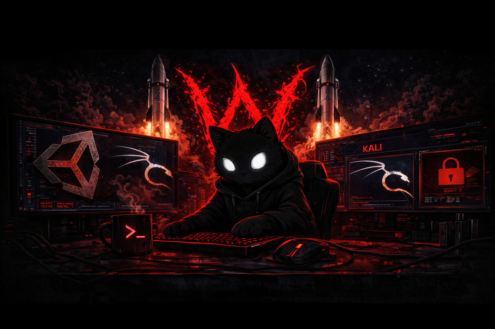

## Hi there 👋

🔴 [Unity Platformer]: Klasik bir 2D platform oyunu. (GitHub Linki)

🔴 [Kali Tool Suite]: Özelleştirilmiş bir siber güvenlik araç paketi. (GitHub Linki)

🔴 [Unity Moon]: Ay simülasyonu ve navigasyon projesi. (GitHub Linki)

<!--
**DeWofflan/DeWofflan** is a ✨ _special_ ✨ repository because its `README.md` (this file) appears on your GitHub profile.

Here are some ideas to get you started:

- 🔭 I’m currently working on ...              
- 🌱 I’m currently learning ...
- 👯 I’m looking to collaborate on ...
- 🤔 I’m looking for help with ...
- 💬 Ask me about ...
- 📫 How to reach me: ...
- 😄 Pronouns: ...
- ⚡ Fun fact: ...
-->
